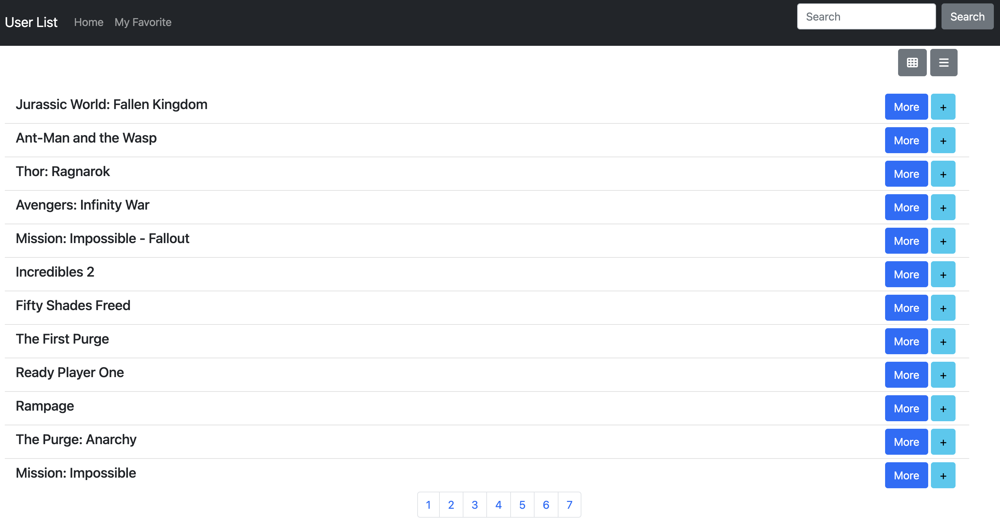

# Alpha Camp Dev C2 M5 - Movie List with list view

This is a first update solution Dev C2 M5

## Table of contents

- [Overview](#overview)
  - [The challenge](#the-challenge)
  - [Screenshot](#screenshot)
  - [Links](#links)
- [My process](#my-process)
  - [Built with](#built-with)
  - [What I learned](#what-i-learned)
  - [Continued development](#continued-development)
  - [Useful resources](#useful-resources)
- [Author](#author)
- [Acknowledgments](#acknowledgments)

## Overview

### The challenge

Users should be able to:

- change view when click list/card button

### Screenshot



### Links

- Solution URL: [https://github.com/Chious/Dev-C2-M5-Final](https://github.com/Chious/Dev-C2-M5-Final)
- Live Site URL: [https://chious.github.io/Dev-C2-M5-Final/](https://chious.github.io/Dev-C2-M5-Final/)

## My process

### Built with

- Semantic HTML5 markup
- [Boostrap5](https://getbootstrap.com) - useful design frame

### 處理步驟

1. 新增 State 去控制目前要顯示的頁面

```js
let showState = "list";
let pageState = 1;
```

2. 承接第一步，由 printDatapanel() 去決定要列印出 `List` 或是 `Card` 形式的資料

```js
function printDatapanel(data) {
  if (showState === "list") {
    return renderList(data);
  } else if (showState === "card") {
    renderCard(data);
  }
}
```

3. 將 `paginator` 中所有提及對於 `page` 的變更同時回傳到 Global Environment 中的 pageState，因此當要切換顯示方式時也能夠知道該列印出哪一個頁面。

```js
paginator.addEventListener("click", function onPaginatorClicked(event) {
  //如果被點擊的不是 a 標籤，結束
  if (event.target.tagName !== "A") return;

  //透過 dataset 取得被點擊的頁數
  const page = Number(event.target.dataset.page);

  pageState = page;
  //更新畫面
  printDatapanel(getUsersByPage(pageState));
});
```

### What I learned

1. 一開始決定開發架構真的很重要，這次在修改的時候最大的困難是要來來回回在文件中翻找。甚至有一度覺得想要打掉重練，從頭用ＭＶＣ架構寫。

### 待迭代

1. 增加ＣＯＤＥ的易讀性，重新改變成ＭＶＣ邊排

## 遇到的問題：

1. 不知道為什麼在按切換頁面的按鈕時有點卡卡的，需要按好幾次才會切換。

### Useful resources

## Author

- Github - [邱佳昇](https://github.com/Chious)

## Acknowledgments None
